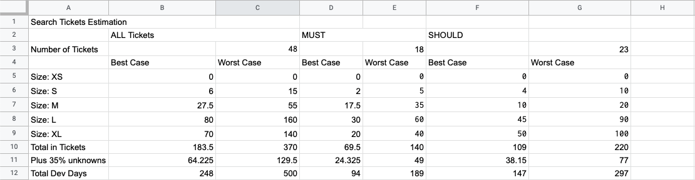
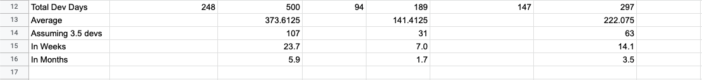

#### Introduction
At Titan Travel we had a big scope for our discovery and PoC phase. At the end of it we had to have a roadmap, with time estimates, for a fully greenfield rebuild of their existing website. Once requirements were gathered, this equated to 484 tickets across 7 trello boards which we had to prioritise, technically validate and then create estimates for.

In this quick read I am going to walk you through how we did this. I hope this will help others who find themselves in similar predicaments in the future.

#### How we did it:

1. **Captured requirements in Trello:**
We found Trello the easiest and quickest tool for us to capture requirements in. It's flexible and simple to use and easy to gain access to, which is not always easy at the start of a project. We talked to users and business stakeholders as well the internal content management team in order to gather these requirements.

1. **Labels:** labels on the Trello Tickets were the key to sorting the tickets, we added labels for:
    
    - **[MOSCOW](https://en.wikipedia.org/wiki/MoSCoW_method) prioritisation:**
    In our case, "MUST"s were for priorities out of user testing as well as features that were existing on the current website. In most cases if the feature was not already on the website it was automatically a "SHOULD".

    - **T-shirt sizing - XS, S, M, L, XL:**
    Not all stories had requirements granular enough to be able to measure complexity and therefore story points. Also story points should only be calculated once the full developer team is in place. Therefore, for now, the best we could do was a 'finger in the air' estimate for the size of the ticket. I was the only technical resource on the project so I gathered a second opinion on these size estimates from another senior dev (thanks @Graz!). Good to get a second opinion for both yours and the clients piece of mind.

1. **Best and worst case time estimates for t-shirt sizes:**
In order to carry out some high level roadmapping and planning, we had to get some idea of the time it takes to develop these tickets. We did this with the following table where each t-shirt size had a best and worst case scenario time estimate:

| Size | Best Case (days) | Worst Case (days) |
|:----:|:----------------:|:-----------------:|
| XS | 0.5 | 1 |
| S |	1	| 2.5 |
| M |	2.5 |	5 |
| L |	5 |	10 |
| XL |	10 |	20|

4. **Extract using Trello Plugin:**
This [CSV Export for trello](https://chrome.google.com/webstore/detail/csv-export-for-trello/nlclhmcmfjpmmngpopdgapiccfddfagi) plugin for Chrome was a great find. With a couple of clicks we managed to get all these trello tickets exported into a readable .csv format

4. **Apply some Excel/Google Sheet magic:** We loaded the .csv export into Google Sheets and once we had the data in table format we started tallying up the tickets using some excel wizardry. Many thanks to our resident excel wizard @Mike Steel for the help with this. The bit of magic that you need involves a few "COUNTIFS". The equation below calculates the total days for all medium tickets with "MUST" priority in the Search Requirements Trello board. 

```=SUM(
  (
    COUNTIF('Titan Search Requirements'!K:K,"*MUST*Size:M*") +
    COUNTIF('Titan Search Requirements'!K:K,"*Size:M*MUST")
  )
  *'Data Sheet - T-shirt Sizes'!B2)
````

*Note: column K contains the labels, we needed 2 "COUNTIFS" to handle the different ways round the labels could have been ordered, this get's even more tricky when you have more labels to separate between*

7. **Add calculations together into a table:** We then did this across all sizes for the MUSTs and SHOULDs, tallying them to together to give us a best and worst case scenario in dev days:



7. **Factor in Contingency for unknowns:** We were never going to capture all the tickets in this discovery phase. As I am sure you have all experienced you are always uncovering more tickets during delivery. After speaking to Service Delivery, 35% is a tried and tested percentage contingency to in odered to account for these unknowns

7. **Working out a usable total:** So now you have a range of total dev days. But we need to try and get to the most reliable timeframe we can. To do this we first took an average of this best and worst case scenario and then started break it down into real time.
    - First we divide by number of developers. We only counted myself, as tech lead, as 1/2 a developer. I needed to make sure I have time to be able to support other developers and as well as attend neccessary meetings
    - Then we broke down the numbers into real days. We say that a month is 18 days as this factors in vacations and illnesses



9. **Rince and Repeat:** We had 7 Trello boards full of tickets, one for each of the 5 major epics, one for the non-functional requirements (incl platform build) and one for Filemaker Database work which we were dependent on. But this was no problem, once we had done one of these trello boards, the others were relatively simple.

#### Conclusion:

This is one of those tasks that can be stressful and fraught with danger. As usual, these estimates were challenged by the client. But having done this process in a measured, understandable and repeatable way we were able to clearly explain and back up our result.

Once these estimates are in place, there are 3 variables which you can play with: scope, resources and time. Now we have this process in place the client and Service Delivery to experiment with these 3 variables until they have a roadmap which is best for the project.

Saying all of this, you still need to be very vocal about the fact that these are estimates and with so many variables in play they are still a 'best guess' not something AND can be held to.

Many thanks for reading, I hope this helps!