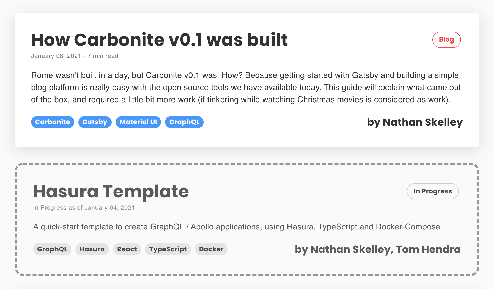

Rome wasn't built in a day, but Carbonite v0.1 was. How? Because getting started with Gatsby and building a simple blog platform is really easy with the open source tools we have available today. This guide will explain what came out of the box, and required a little bit more work (if tinkering while watching Christmas movies is considered as work)

### The Purpose Behind Carbonite

The idea behind Carbonite was to provide the ANDis of Turing with a knowledge base that we could take complete ownership of - somewhere that we could share our thoughts and ideas, showcase what we believed best practice looked like, and even try out some ideas that we could later apply to client projects. From my involvement in lots of different communities, it always felt like we were circling around the idea as a collective, but hadn't yet made it a reality. There had been somewhat similar projects proposed in Turing Grow, but these were always focussed on some kind of business-focussed end result. The technology and the knowledge we would gain from the build felt like something of an afterthought, even if that was completely unintentional.

I wanted to approach the problem in a new way in 2021. I wanted to strip away blockers, focus on the core idea and do everything that I could to encourage community engagement, as that's the only way that any endeavour like this survives. That meant making it easy for anyone and everyone to get involved, making the product (whatever it may be) accessible both in practice and as a concept, and creating something that requires minimal effort to maintain.

The answer (at least from my perspective), was almost embarrassingly obvious, and one that I certainly cannot take lone credit for. **Make a blog**. Something we can all contribute to, that's easy to host, and allows us to move and experiment in whatever direction we choose to as a community.

Fast forward past a few phone calls to test the water and one dodgy Star Wars themed reference to "freezing and storing our best assets", and that was it. **Carbonite had been born**.

### Getting Started with Gatsby

So where to start with the blog then? After all, there's plenty of different ways to achieve this kind of thing, though from the heading above it should come as no great shock that I chose to built it with [Gatsby](https://www.gatsbyjs.com/). The more pertinent question in this case then is not "how to buid a blog", but **"why build one with Gatsby?"**.

I don't consider myself to be a fanboy of any particular technologies, I just like getting things done in the easiest way, so thankfully for any readers this paragraph isn't a deep, romantic, Bridgerton-worthy confession of love for Gatsby in any way, or a deep dive into what it's capable of (though I'm hoping it won't be long before we start seeing some blog entries along those lines). Instead I'd like to keep things more objective and concise:

- Gatsby, and assocated technologies like GraphQL, are hot stuff right now, and building an internal tool with it will give us a great playground in which to learn and develop our skillset
- Owning the code base gives us complete flexibility to whatever we want and build Carbonite into something that truly works for us. We can control and experiment with every part of it, meaning literally anybody in Turing can get involved in some capacity, even if they've never touched a line of code
- This is my favourite - Using a static site built out of a simple repo means that we work with what we're used to. Github, PR's, build pipelines, it's all stuff that we work with on a daily basis, so we're either working with concepts we're already comfortable with, or learning new things that will help us every day on client projects

So with those 3 points in mind, it was off to the [Gatsby Starter Library](https://www.gatsbyjs.com/starters/?) that I went!


Just like any of these kind of start libraries, it can be a little overwhelming to see just how many different different ways there are to get started with a project such as this (there are 100 ways to peel a potato, as Andrei might say). To keep things simple (and to work on my own understanding of Gatsby), I chose literally the first one on the list. 

The **gatsby-starter-blog** comes with plenty stuff, but this is what I was after:

- A basic setup for a working blog (I'd never built one with Gatsby so was mostly after a sensible project structure)
- Support for Markdown posts with images
- Code syntax highlighting in posts (via [Prismjs](https://prismjs.com/))


So there we go, one quick repository clone later and Carbonite v0.1 is alive! Though it doesn't look very Carbonite-y, and those certainly are not AND colours, and **nobody cares that you live in San Fransisco Kyle!**

### Adding Material UI and Fonts

So now that Carbonite is alive (kind of), we need to make it look the part. For theming, I decided to go for Material UI for now, partly because it's a great tool that we use a lot on client, but also just because I wanted to make the blog look great quickly, and I know Material like the back of my hand (though I'll be glad to be rid of the ripple effect!).

So how to start? Well I could import Material UI, wrap it around my base component, setup a provider, make sure it's working correctly on client and server render etc. Or I could do the things the Gatsby way, and look for a plugin!


With Gatsby, there are a ton of plugins, and while we should be careful to make sure we don't use things that we don't actually understand, they can be a great way to get things spun up quickly, and offset a lot of code maintenance. In this case I'll be using the [Material UI Theme Plugin](https://www.gatsbyjs.com/plugins/gatsby-theme-material-ui/?=material%20ui) because it offers the following: 

- Easily access Material UI components with no provider setup
- Normalise the CSS with the [CSS Baseline](https://material-ui.com/components/css-baseline/) top-level component
- Quickly add a customisable theme to my components
- Access specific Material-styled [Gatsby Link](https://www.gatsbyjs.com/docs/reference/built-in-components/gatsby-link/) components

#### Updating the Gatsby Config File

Installing and using the plugin is easy. First we install it (I've been using Yarn for Carbonite so far):

```js
// with yarn
yarn add gatsby-theme-material-ui @material-ui/core
```

Then we go to the `gatsby-config.js` file and add it to the **plugins** section:

```js
plugins: [
    {
      resolve: `gatsby-theme-material-ui`,
      options: {
        webFontsConfig: {
          fonts: {
            google: [
              {
                family: `Poppins`,
                variants: [`700`],
              },
            ],
          },
        },
      },
    },
    // ... other plugins
]
```

In this case we've imported the plugin and also setup a Google Fonts import to download our beloved [Poppins](https://fonts.google.com/specimen/Poppins) font. Here we're only downloading the 700 weight version as it's only used for headers and bold content.

Now that we've imported Material UI, we are able to use the components, but even before we do that, some changes have already taken place thanks to the **CSS Baseline** that it automatically wraps around our project. The fonts have now been normalised to use Roboto (conveniently this is used by both AND and Material UI), and our pages now have the correct base margins, paddings and other small touches. This allows us to get ride of the `normalize.css` file that the starter template uses by default.

The last bit for us to do here is to actually customise the theme so that it matches the AND palette.

#### Customising the Material Theme

To customise the Material theme, we can use the [standard theme customisation API](https://material-ui.com/customization/theming/#createmuitheme-options-args-theme) that a lot of us are already familiar with, we just have to apply it in a certain way that works with the plugin we're using.

As stated in [the docs](https://www.gatsbyjs.com/plugins/gatsby-theme-material-ui/#theming), all we need to do is export a theme object from the file `src/gatsby-theme-material-ui-top-layout/theme.js`. That file path is a bit of a mouthful, but at least it's unlikely that we'll lose it in our folder structure!

At this point, the theme is pretty simple, and is only used to apply a few colours and set our heading font family to **Poppins** (no need to set the main body as AND and Material both use Roboto):

```js
const theme = createMuiTheme({
  palette: {
    primary: {
      main: "#ff323c",
    },
    secondary: {
      main: "#2897ff",
    },
    text: {
        primary: '#323232',
        secondary: '#7a7a7a'
    }
  },
  typography: {
    h1: {
      fontFamily: '"Poppins", "Helvetica", "Arial", "sans-serif"',
    },
    h2: {
      fontFamily: '"Poppins", "Helvetica", "Arial", "sans-serif"',
    },
    h3: {
      fontFamily: '"Poppins", "Helvetica", "Arial", "sans-serif"',
    },
    h4: {
      fontFamily: '"Poppins", "Helvetica", "Arial", "sans-serif"',
    },
    h5: {
      fontFamily: '"Poppins", "Helvetica", "Arial", "sans-serif"',
    },
    h6: {
      fontFamily: '"Poppins", "Helvetica", "Arial", "sans-serif"',
    },
  },
})
```

To customise these areas, we've utilised the [Palette](https://material-ui.com/customization/palette/) and [Typography](https://material-ui.com/customization/typography/) values of the **createMuiTheme** api. Overriding the theme is very simple, and this just scratches the surface, as Material offers a massive amount of customisation. As Carbonite grows it may make sense for us to extend the theme further, and possibly even look at providing [Global Style Overrides](https://material-ui.com/customization/components/#global-theme-override), but for now the default theme does the job nicely.


### Creating some components

Now we're up and running it's time to get going with some content!

The starter template provides an ok setup for the index page, but I felt that we could do with something that fit our design scheme a little better. AND has a very bright colour palette, which can easily come off as chaotic if it's used incorrectly, so it made sense to offset our bright red and blue blocks with some softer tones, subtle shadows and plenty of white space, so a nice, simple card-based design made sense for the homepage (obviously I have some wilder ideas for where this could go, but with only a few blog posts to display at this point, it doesn't need to be fancy).

Building components in Gatsby is no different to making them in any other React application, so putting together the card was easy, especially with the Material UI components and styling system speeding up the process. There were a few things I knew I'd need to display on each card, such as the title, authors, descriptiona and tags (for when we want a better way to filter our entries in the future), but I also wanted to be able to show whether an entry was complete, or a work in progress. A very important part of Carbonite from the start was that we should be able to share what we know, but also inform others as to what we're currently working on or researching, so that we can help each other and ensure not everyone is chasing the same particular rabbit.



In this case I came up with 2 variants, one bright and bold to indicate completed entries, and one inspried by a blueprint, to indicate a work in progress. And yes, I did take this screenshot while writing this blog post - so meta.

I made some changes to a few other components, as well as adding and deleting some too (sorry Kyle, your bio is no longer required). The biggest change however was not to a component, but to the **blog-post** template, which is probably unsurprising.

### Updating the Blog Post Template

When building blog entries, Gatsby pulls data from it's data graph (via GraphQL) and then injects the data into a **template**. This process happens when pages are built, and can be seen in the `gatsby-node.js` file. Different templates can be assigned to different types of idea if required, but so far Carbonite only has 1 blog type.

I won't go into the process of how this build works, as it's much easier to just dive into the Gatsby docs to understand it, and it's a little outside the scope of this post. Instead, let's go into what the `blog-post.js` template does instead. 

Below is the page query that the template calls for each blog post:

```js
export const pageQuery = graphql`
  query BlogPostBySlug(
    $id: String!
    $previousPostId: String
    $nextPostId: String
  ) {
    site {
      siteMetadata {
        title
      }
    }
    markdownRemark(id: { eq: $id }) {
      id
      html
      frontmatter {
        title
        date(formatString: "MMMM DD, YYYY")
        description
        author
        tags
      }
      timeToRead
    }
    previous: markdownRemark(id: { eq: $previousPostId }) {
      fields {
        slug
      }
      frontmatter {
        title
      }
    }
    next: markdownRemark(id: { eq: $nextPostId }) {
      fields {
        slug
      }
      frontmatter {
        title
      }
    }
  }
`
```

This probably looks complicated, but it can be broken down very easily:

- The **$id**, **$previousPostId** and **$nextPostId** are provided by Gatsby and are used by the query to find the correct blog entry from the available markdown files
- The **markdownRemark** section contains the information for the current blog post, and from that the following are recieved:
  - The **html** of the blog post (this is actual content)
  - The **frontmatter** (this is essentially metadata like the author and description - this is stored at the top of a markdown file)
  - The **timeToRead** which is calculated by Gatsby
- Below the content, information for the **previous** and **next** blog posts is also made available so that we can provide on-page navigation to them. Note how we only get the slug (url) and the title, not the content

The data from this **Page Query** is passed to the template component itself and is available as **data**:

```js
const BlogPostTemplate = ({ data, location }) => {
    // component code that uses data
}
```

Within the component, the **data** parameter is used to assemble the page, which provides things like the header, navigation buttons for the next and previous entries, and the HTML content itself, which is set into a `section` element.

#### Styling the Blog Contents

We don't actually build the blog content HTML via React, it is provided to us via the [Gatsby Transformer Remark Plugin](https://www.gatsbyjs.com/plugins/gatsby-transformer-remark/), and as such, we don't add specific classnames to elements as we might be used to with component-based development. Therefore, to provide styles to the pre-generated HTML I've still used Material UI but applied CSS-style inheritence selectors to globally style specific elements:

```js
const useStyles = makeStyles(theme => ({
  post: {
    "& *": {
      ...theme.typography.body1,
      fontWeight: undefined
    },
    "& li": {
      margin: theme.spacing(3,0)
    },
    "& h1": theme.typography.h1,
    "& h2": theme.typography.h2,
    "& h3": {
      ...theme.typography.h3,
      borderBottom: `solid 1px ${theme.palette.divider}`,
      paddingBottom: theme.spacing(1),
      marginBottom: theme.spacing(4)
    },
    "& h4": {
      ...theme.typography.h4,
      marginBottom: theme.spacing(2)
    },
    // ... more styles
```

This gives us easy access to the **theme** object while allowing us to globally apply styles based on element type, rather than specific nodes. In this case, the `& {type}` syntax applies those styles to any child type within the blog post HTML. There are other ways to do this, and digging deeper into the transformer documentation reveals ways of customising the generated code, but this seemed like a nice easy win to start with. Leave the smart stuff for later.

### Editing the Frontmatter types

**Almost done!** We now have a blog that allows us to add entries and has the right kind of styling, the last bit is to update the **frontmatter** that each of our blog posts allows.

Frontmatter is just markdown metadata, and allows us to add details to the file that we want to separate from the actual body of the blog entry.

Here is an example from the original starter template: 

```js
---
title: Hello World
date: "2015-05-01T22:12:03.284Z"
description: "Hello World"
---
```

In this frontmatter, the author has added a title, a date and a description. There is essentially no limit to what frontmatter can include, as it is completely defined by the author, you can even [link to header images in frontmatter](https://www.gatsbyjs.com/docs/working-with-images-in-markdown/). For the Carbonite frontmatter, I added the following (on top of the title, date and description):

- The **author**
- The **type** of entry (we don't have specific types yet but I wanted to demo what it looked like)
- **Tags** so that we can easily find specific content once we have a library

It can just be left there, but any developer knows how easy it is for things to go wrong when data types aren't well specified, and this could become very important as Carbonite grows, as we would want to minimise the likelihood of breaking changes. Luckily, we can customise the schema of our frontmatter so that gatsby throws an error anytime it doesn't match what it expects.

To do this, we use the `createSchemaCustomization` value in the `gatsby-node` file:

```js
// in gatsby-node.js
exports.createSchemaCustomization = ({ actions }) => {
  const { createTypes } = actions

  createTypes(`
    type SiteSiteMetadata {
      author: Author
      siteUrl: String
      social: Social
    }

    type Author {
      name: String
      summary: String
    }

    type Social {
      twitter: String
    }

    type MarkdownRemark implements Node {
      frontmatter: Frontmatter
      fields: Fields
    }

    type Frontmatter {
      title: String
      description: String
      date: Date @dateformat
      author: String
      type: String
      tags: [String]
    }

    type Fields {
      slug: String
    }
  `)
}
```

Anyone who has created a GraphQL server will recognise the syntax that we use to define the types. In this case, we need to assign `Frontmatter` as a child to the `MarkdownRemark` type, and then we can edit the type to match our expected format. This means that whenever an unexpected type is recieved (a numeric tag for instance), the Gatsby build will fail.

#### Using the Frontmatter in our Pages

Now that we've updated the schema of our frontmatter, we can pull it in via our graphQl queries. So far in Carbonite the frontmatter is used in two main ways: **displaying** and **filtering**.

For **Displaying**, we simply pull the frontmatter in via a graphQL query and apply it from the **data** prop. This query is used in the `index.js` page, so we pull in the frontmatter to display the post details in the blog card.

```js
// in templates/blog-post.js
export const pageQuery = graphql`
  query {
    site {
      siteMetadata {
        title
      }
    }
    allMarkdownRemark(sort: { fields: [frontmatter___date], order: DESC }) {
      nodes {
        excerpt
        fields {
          slug
        }
        frontmatter {
          date(formatString: "MMMM DD, YYYY")
          title
          description
          author
          inProgress
          tags
          type
        }
        timeToRead
      }
    }
  }
`
```

For **Filtering**, we use the frontmatter in the `gatsby-node.js` file to filter out blogs where the `inProgress` value is `true`, this is because we want to see that a post is in progress when we're on the `index.js` page, but we don't want an actual page to be generated for it at this point (this could change in the future), so we filter it out:

```js
// in gatsby-node.js
 const result = await graphql(
    `
      {
        allMarkdownRemark(
          sort: { fields: [frontmatter___date], order: DESC }
          limit: 1000
          filter: { frontmatter: { inProgress: { ne: true } } }
        ) {
          nodes {
            id
            fields {
              slug
            }
          }
        }
      }
    `
  )
```


### The Future of Carbonite

That's pretty much everything that went into the build of Carnbonite v0.1. This is very much a first iteration, and I'm excited to see how we take it forward as a community. I've summarised some ideas of improvements that we could make to the platform itself in the [Roadmap](/roadmap) entry, but I'm more excited to see some brilliant blog entries contributed by different members of the club. Hopefully this will become a place where we can share and learn from each other, and make stand out in the technology landscape.