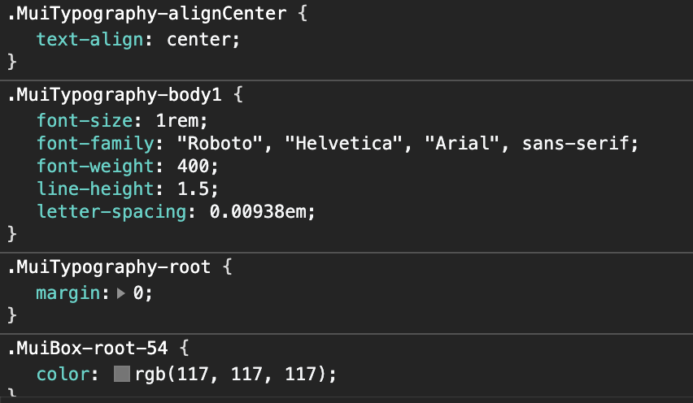

The [Box](https://v4-10-2.material-ui.com/components/box/) component provded by Material UI is an inconspicuous, but incredibly powerful tool in the arsenal of any developer using Material in a project. It has direct access to all of the functionality provided by the [Low-Level Styling System](https://v4-10-2.material-ui.com/system/basics/), and can be used as an easy shorthand to hook into the overall theme of the application and quickly create components that look and feel consistent.

### Using the Box Shorthand

Utilising the **Box** component is easy as it has a simple and verbose prop structure that allows for minimal code. For example, in the following case, we can easily slim down a lot of code to just a few lines by correctly using the **padding** and **background colour** props. Here, we'll be applying some styles using the createStyles hook:

```jsx
// here we create a style hook using the provided theme
const useStyles = makeStyles(theme => ({
  root: {
      padding: theme.spacing(2, 1, 2, 3),
      backgroundColor: theme.palette.primary.main, 
      fontWeight: 700
  }
}))

const MyComponent = {
    // here we create a classes object using the style hook
    const classes = useStyles();

    // here we actually return the Box component with the `root` class applied
    return <Box className={classes.root}> Hello World </Box>
}
```

By using the shorthand props, we can easily compress this into a much smaller package:

```jsx
const MyComponent = <Box py={2} pl={3} pr={1} bgColor="primary.main" fontWeight={700}> Hello World </Box>
```

Here we've managed to compress everything into 1 line of code. We do need to be careful however, as the goal isn't always just to compress the number of lines, and sometimes we will come across situations where it makes far more sense to use the **className** syntax, especially when we're applying a lot of JSS to a component. In cases where we're only making small changes however, it can be incredibly useful to use the shorthand.

The problem arises when we try to apply this to same shorthand to other components however.

### Using the Clone Prop

**Box** is the only Material component that has access to all of the low-level styling super powers, so the question is: how do we make this shorthand accessible when we're working with elements other than Boxes? Let's say for example that we want easy access to the whole Material UI palette to provide some styling to some text. The **Typography** component only has access to a select list of colours, whereas **Box** can access the whole palette, so let's use that:

```jsx
// the p element that the Typography creates will inherit
// the grey.600 colour from the parent Box
<Box color="grey.600">
    <Typography align="center">
        Hello World
    </Typography>
</Box>


// this will result in an HTML structure that looks like this
<div class="box-style">
    <p class="typography-style">Hello World</p>
</div>
```

So this system will work, and the **Typography** will correctly inherit the colour from the Box, the end result is a **div** element that isn't really doing anything, it's just there to provide a style to its child. This is a case where something has ended up in the final DOM just for the benefit of the developer, which isn't great. 

Instead, what we can do here is use the **clone** prop to make the **Box** clone its child and simply apply its styling over the top:

```jsx
<Box color="grey.600" clone> // now using clone
    <Typography align="center">
        Hello World
    </Typography>
</Box>


// this will result in an HTML structure that looks like this
<p class="typography-style box-style">Hello World</p>
```

This results in a single HTML element being created with all of the neccessary styling, rather than creating multiple. This exact styling solution is used in the `blog-post.js` file of Carbonite v0.1.0 to provide the **grey.600** colour to a Typography element, and we can see that it produces the following HTML:


Here the root classes are first applied (child first, then parent), and the prop classes are applied afterwards. This is an important part of cloning, as the priority of styling may cause conflicts, and **you may need to inspect the rendered HTML to find the issue**.

If we have a look at the how the CSS actually applies, it looks like this:



Here the base **Typography** classes are all applied as we would expect, but we also have the added benefit of the font colour being provided by the **Box** class, which has completely merged into the child element. Note that in this case the **Box** styles are lower priority than the **Typography**, and so if we were to try and apply a **margin** via the cloning process, the child's root styling would override it.

So to finish up, we've given our **Typography** element access to the shorthand syntax, but reduced the amount of HTML that is actually outputted. In this case the impact is minor, but other applications could allow for much greater gains. The **Box** shorthand can be used to do a lot, including [Borders](https://v4-10-2.material-ui.com/system/borders/), [Flexbox Settings](https://v4-10-2.material-ui.com/system/flexbox/), [Shadows](https://v4-10-2.material-ui.com/system/shadows/) and much more.

### Things to Watch Out For

So it's fair to say that the **Box** shorthand combined with the **clone** prop can significantly slim down parts of your codebase if applied correctly, but there are definitely some things to keep an eye out for:

- Just because you can use this syntax, that doesn't mean you always should. Before using something like this, always make sure that you are applying it consistently and that the rest of your team agree to it. **Consistency is often more valuable than efficiency**.
- Understand when it makes more sense to use a shorthand and when to apply a more verbose syntax. Shorthand can be brilliant, but it can sometimes obfuscate parts of your code and make it harder for others to read. If you're applying a lot of styling, it may make more sense to break it out to make it clearer.
- When using cloning, be very aware of the priority order of different CSS values. Applying something via the **Box** may not actually work if the child component itself overwrites it. An example of this is margins in **Typography** elements, where the element itself sets margins to 0 regardless of the **Box** styling. Always be prepared to inspect the rendered HTML to ensure the correct result if you have issues.
  
### Further Reading

To look into what else you can do with the Material UI styling system, check out the [Box Docs](https://material-ui.com/components/box/) or the [Styling System Docs](https://v4-10-2.material-ui.com/system/basics/) for a look at the low-level syntax that pieces all of this together.