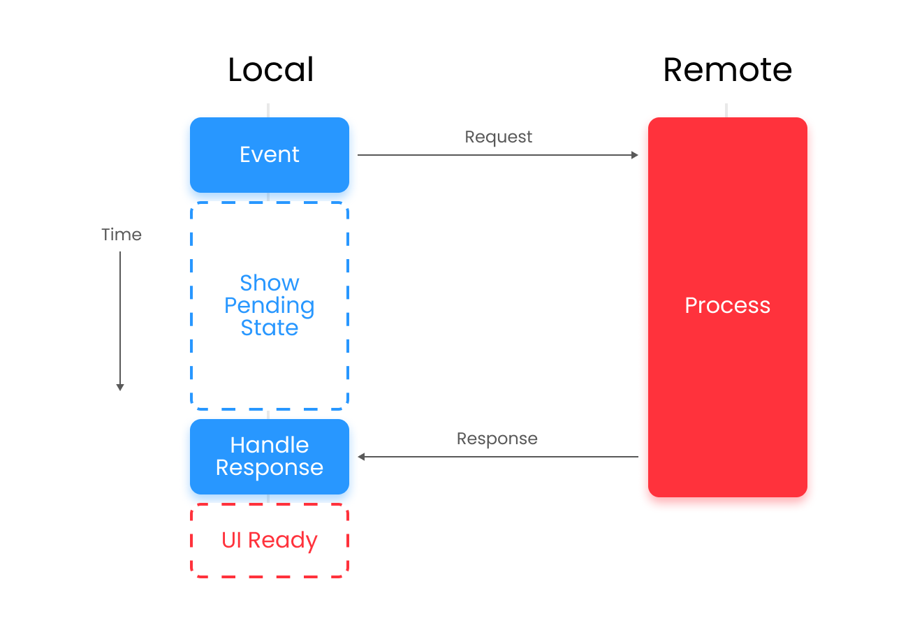
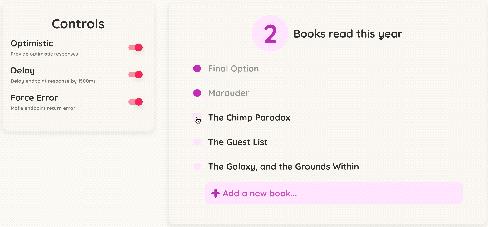

Regardless of what kind of application we build nowadays, it's very likely that at some point we'll be interacting with a remote data source of one variety or another. In almost all cases we will be querying data from said source, and sometimes we may also have the ability to mutate that data via the client application, changing the shape or content of it.

When we mutate data, we typically send off a request to the server asking for a change to be made, and then wait for the response to come back, either confirming the change, or returning an error. While we wait for the request to return, we can show the user that some action is taking place by showing a pending state, or through some other means, but the end result is the same: **the user is having to wait**.

While a little waiting won't completely ruin a user experience, it can make things feel a little slow, and let's face it, everybody wants everything right now (thanks Amazon). Luckily we don't have to leave our users sat staring at loading spinners all day though, as we can (relatively easily) provide a super snappy-feeling experience by applying a data management technique called **Optimistic Updates**.

### What are Optimistic Updates?

Another wonderful "does what it says on the tin" type method, **Optimistic Updates** literally just means that we optimistically update our client side data by assuming that the request response has come back successfully - we are literally optimistic that the request will come good. This serves as both an explanation and warning, as you wouldn't want to use this method on an endpoint that's held together with duct tape and hope (more on the dangers later!).

#### The Problem with Traditional Requests

In a typical mutation flow, the client will send off a request, display some kind of pending state and then update once the request has returned successfully (it will also handle any returned errors at this point as well). That's all well and good, but this can leave your user a little bored (or experiencing that awkward moment when a game screen goes black while loading and they have to stare back at themselves until the pretty colours come back).

This method can also leave you a little at the whim of your network connection or server speed. This isn't so much a problem if you're using a perfect connection and the server can respond very quickly, but if you're using mobile, have a slow network, or the server is recieving a lot of requests, you may find yourself waiting a little longer than expected.

**The important thing to note here**, is that a few things have to happen before the UI is ready to move on, and therein lies our problem - we don't want to wait, we want to go fast!



#### How Optimistic Updates Help us go Fast

When we apply **Optimistic Updates**, we're basically saying:

> I reckon this update is going to go through fine, and I know what it's going to come back with, so let's just update it here and now so we can all move on
> with our lives

So rather than waiting for the request to return (which could be very quick or quite a while based on the factors discussed earlier), we just **update the local data store to show the expected response**. This means that the UI is immediately available and our user can carry on with their business, unaffected by the fact that there may or may not still be a network request running in the background.


This means that for a brief moment, the local and remote data will be out of sync, and the user is working with an optimistic data layer. Once the network request returns, 1 of 2 possible outcomes will take place:

1. The response comes back exactly how we expected it to, the optimistic data is thrown away and the remote data is applied - we're now back in-sync
2. Some error took place, so we throw away the optimistic data and handle the error - again, we're back in sync

Handling successes is simple, but **recieving errors is where Optimistic Updates forces us to think about our user flows**, as we need to elegantly handle the error while also taking the user back to a data state before a mutation that they assumed went perfectly fine. Failing to handle this loop well could very well make your optimistic updates more trouble than they're worth, so it's very important to consider all outcomes before following this methodology. Of course, if your optimism is well founded and errors are incredibly rare, you've got far less to worry about (take that pessimism!). 

### Technical Setup

For this example I'll be creating a simple reading list application where I can track the books I've read so far this year and the ones I want to read. It should allow me to do the following:

- Store a list of books
- Add books
- Update the names of the books
- Toggle whether I have read them or not

Here's the design that I'll be using (I've been playing a lot of Animal Crossing so I wanted to create something that fit into that design palette).


**As Optimistic Updates is a methodology, not a technology**, it can be implemented in a number of ways, but it's easier done with some tools than others. In this example, I've chosen to use [GraphQL](https://graphql.org/) and [Apollo Client](https://www.apollographql.com/docs/react/), because I think that GraphQL is a wonderful way to query data sources, and Apollo comes with an optimistic data layer already built into it. Do keep in mind though that this can be achieved with any technology, and I'll be following this post up with an example using REST and [SWR](https://swr.vercel.app/) (because I'm 100% not a GraphQL fanboy).

I won't be going through the details of how I've set up my Apollo Client instance as it's pretty irrelevant, but the code is all available [right here](https://github.com/SkelleyBelly/optimistic-updates-demo). To summarise, it's a simple GraphQL server that runs on the client-side that allows me to query and mutate my book collection. Mutations accept **delay** and **error** variables that allow me to control whether the resolver will be slow (representing a delay of 1500ms) or return an error outright - this means I can actually demonstrate the value of optimistic updates.

As I'm using GraphQL, the query and mutation structures are incredibly simple:

```ts
export const GET_BOOKS = gql`
    query GetAllBooks {
        books @client {
            id
            title
            hasBeenRead
            __typename
        }
}`

export const UPDATE_BOOK = gql`
    mutation UpdateBook($id: Int!, $title: String!, $hasBeenRead:Boolean!, $delay:Int, $error: Boolean) {
        updateBook(id: $id, title: $title, hasBeenRead: $hasBeenRead, delay: $delay, error: $error) @client {
            id
            title
            hasBeenRead
            __typename
        }
}`

export const ADD_BOOK = gql`
    mutation($id: Int!, $title: String!, $delay:Int, $error: Boolean) {
        addBook(id: $id, title: $title, delay: $delay, error: $error) @client {
            id
            title
            hasBeenRead
            __typename
        } 
}`
```

Using these in the application is very easy thanks to the hooks provided by Apollo. Check out the repo for the exact code being used (in all it's TypeScript glory), but this is the gist of it:

```tsx
// import the hooks from Apollo Client
import { useMutation, useQuery } from "@apollo/client";

// import my queries and mutations from their definition file
import { GET_BOOKS, UPDATE_BOOK, ADD_BOOK } from "./query";

// then within the component...
const { createErrorMessage } = useSnackbar();

// query my book collection using the `useQuery` hook
const { data } = useQuery<{ books: Array<Book> }>(GET_BOOKS);

// create a mutation function to update an existing book
  const [updateBookMutation] = useMutation(UPDATE_BOOK, {
    onError: createErrorMessage,
  });

// create a mutation function to add a new book.
// this uses cache modification to add the new book to the Apollo Cache when the response returns.
// more info about that is available here https://www.apollographql.com/docs/react/caching/cache-interaction/#cachemodify
  const [addBookMutation] = useMutation(ADD_BOOK, {
    onError: createErrorMessage,
    update: (cache, { data: { addBook } }) => {
      cache.modify({
        fields: {
          books: (existingBooks, { toReference }) => [
            ...existingBooks,
            toReference(addBook),
          ],
        },
      });
    },
  });

  // to actually use the mutations hooks...
  // updating a book with no error and a 1500ms delay
    updateBookMutation({
      variables: {
        id: 'some_book_id',
        title: "Harry Potter",
        hasBeenRead: true,
        delay: 1500,
        error: false,
      },
    });

  // adding a new book with no delay but an error
    addBookMutation({
      variables: {
        id: "some_generated_id",
        title: "Where the Crawdads Sing",
        delay: 0,
        error: true,
      },
    });
```

#### How the Application Works Without Optimistic Updates

To manage whether delays, optimistic updates and errors are being applied, I created a small control panel for the application - this makes it easy to switch on different behaviours and see how they work together. Without optimistic updates, and with **delays** active, we get an experience that feels slow (I did try to get a GIF of the toggle but it's hard to see what's happening! Best to just check out the hosted app to play with it).


The application feels slow because it's using traditional requests, and so is waiting for the response to return before it actually updates the screen. Since we've delayed the endpoint response by 1500ms (a massive exaggeration but still possible), it's waiting all that time before it adds the book to the list. But since we know exactly what kind of content we'd like to add to the page, and we're super confident that it will successfully, we have a brilliant candidate for **Optimistic Updates**. Which brings me to...

### Applying Optimistic Updates

Now we get to one of the main reasons that I'm using **Apollo**. It's a lovely GraphQL client in it's own right, but it has an [optimistic layer](https://www.apollographql.com/docs/react/performance/optimistic-ui/) baked right into it, which makes it incredibly simple to get started. To apply **Optimistic Updates**, I just need to tell **Apollo** what to expect when I send off a request.

Here's what it looks like in practice.

```tsx

// the `optimisticResponse` option takes a function that uses the parameters from the `updateBookMutation`
// mutator to pass new content into the optimistic layer. In this case, it takes the `id`, `title`, and `hasBeenRead`
// keys of the `Book` object and returns the expected response.

// Note that the shape of the data is very important, and this mimics the endpoint exactly, down to the 
// query name (updateBook) and the type (Book). These are used alongside the `id` to correctly update 
// the Apollo Cache
const [updateBookMutation] = useMutation(UPDATE_BOOK, {
  onError: createErrorMessage,
  optimisticResponse: ({ id, title, hasBeenRead }) => ({
        updateBook: {
          id,
          hasBeenRead,
          title,
          __typename: "Book",
        },
      }),
  });


// when adding a new book, we return a new book in a default state (unread). This optimistic response
// is passed into the `update` option in exactly the same way as a normal response, so replicating
// behaviour is incredibly easy
const [addBookMutation] = useMutation(ADD_BOOK, {
  onError: createErrorMessage,
  optimisticResponse: ({ id, title }) => ({
        addBook: {
          id,
          hasBeenRead: false,
          title,
          __typename: "Book",
        },
      })
  update: (cache, { data: { addBook } }) => {
    cache.modify({
      fields: {
        books: (existingBooks, { toReference }) => [
          ...existingBooks,
          toReference(addBook),
        ],
      },
    });
  },
});
```

With Optimistic Updates now enabled, we can get an immediate response on the client side even when the endpoints are delayed by 1500ms. This means (presumably) happy users and a snappier feeling application.


**Apollo** also makes it easy for us to handle the behaviour when there are errors. In the example below, we've activated **delays**, **optimistic reponses** and **errors**, so that we optimistically update the client view, then revert back to the original state once the error comes in (while also showing a custom snackbar to indicate an error).



### Important Considerations

So we can see that applying **Optimistic Updates** can make applications feel very fast and provide instant user feedback, but they do have a darker side, and can cause more than one headache if used incorrectly. If you are going to apply them a project (which I really do recommend if you can), make sure that you can confidently answer each of these questions:

##### Do I know exactly what data I'm going to get back?

If you don't know exactly what response you'll get back from the server, it's incredibly difficult to do it optimistically. If, for instance, we get back information that can only be known on the server (information about distantly connected information for example), we can't easily update the client without waiting for the response. In these cases is can be tempting to over-query or add more complex logic to the client-side, but this is a very slippery slope that can result in huge code duplication.

##### Am I able to handle these complex error journeys?

Yes we're optimistic about our responses, but sometimes things just go wrong, and if you leave your users in a real pickle, that could cause problems. For example, switching a toggle back to its original state doesn't cause much bother, but what if a user has just written and attempted to save a short novel in a textbox? Do you just wipe it out? Do you open the textbox back up and populate it again? Well what if they've already moved onto another textbox? Only adopt optimistic updates if you're confident that you can handle all of the interesting user journeys that it opens up, from both a technical and design perspective.

Even beyond errors, it's worth considering the danger of having users out of sync with the remote data source but still able to act on that data. If something exists only optimistically on the client-side for example, should the user be able to interact with it in the same way as they would if it came from the remote data source? A little time spent out of sync can be useful, but all optimistic and no request can make Jack an error-prone app (that works, right?).

##### How optimistic am I about this request?

It sounds stupid, but if you're trying to apply optimistic updates, make sure you're optimistic about the request. If you know that 99.999% of the time your request will be successful, then it would make sense to optimistically update it (even better if you're able to justify this with user analytics). But if it fails 2 times out of 5? Probably best to avoid that one for now.

### Conclusion

When used correctly, adopting **Optimistic Updates** can make your application feel lightning fast, and will leave users scratching their heads thinking "Just how do they manage to send off those requests so damn quickly?". Just use caution (or a simple checklist of questions) before applying them, as like many design patterns, poor execution will probably leave you worse off than just steering clear in the first place. 

But if you're confident that your endpoints are reliable, and you fully understand the data that you're expecting to recieve, they can be a wonderful, and simple, addition to any data-driven application. Using **Apollo** to implement them is incredibly easy, and I'd generally encourage anyone interested in **GraphQL** to start with the tools it provides.

The full demo for this build is [hosted here on Netlify](https://optimistic-update.netlify.app/). I (optimistically) hope that you have fun playing with it!