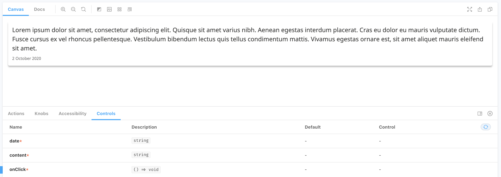
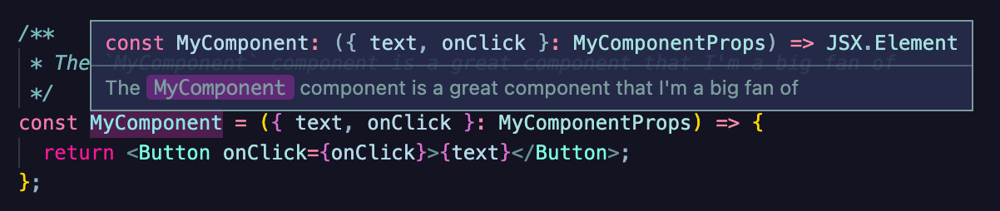
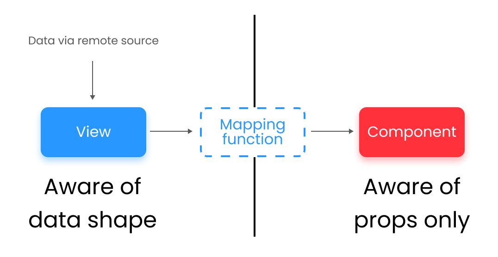

After a year of building with TypeScript and React on a client engagement, it should come as no surprise that there are things I wish I knew at the beginning of the project - some things that I would have liked to do more of, and some things I wish I'd never done in the first place. This post is a retrospective of my time with React and TypeScript, and includes some warnings of the patterns I'll definitely be avoiding in the future, and some that I think are wonderful and should be encouraged.

Broadly, the goals of this guide can be summed up as the following:

> Guidance and design patterns that encourage the creation of easy to read, expressive React + TypeScript components, and repos that follow sensible and consistent rules, all in aid of minimising the intertia and cognitive load felt when moving around and between projects

**Before we go any further though**, it's worth pointing out that I've loved working with React and TypeScript, and I'd love to do it again. If I was asked to jump onto a vanilla JSX project right now I don't think my heart could take it, as I'm a firm believer that utilising TypeScript helped us to avoid a plethora of runtime errors, and forced us to consider how the application as a whole could (and more importantly *should*) come together. When TypeScript is used well it is a joy to work with, and makes our code easy to read and interpret. When it's used badly, however, it can be a nightmarish weight around your ankle, so hopefully this guide will prevent anyone who reads it from experiencing their own nightmare in the future.

### The sections covered in this guide

I could go on forever about TypeScript and React good practice, and different ways to build things, but since this retrospective needed to come together in a day, I've limited my thoughts to 3 specific areas:

- **Project Setup**: How I would set up a brand new React and TypeScript project if I had complete creative control
- **Component Structure**: Guidance and design patterns that I would encourage when creating new components in a project
- **Props**: My personal rules for creating component interfaces that are easy to use, and even easier to understand


### Project Setup


These rules cover the basic project setup when working with React and TypeScript. This is the smallest section, not because it's the simplest, but because the way in which a project is setup could be influenced by a number of factors, and applying universal rules is difficult. 

That said, these guidelines should be applicable to any React and TypeScript project:

##### Perform strict null checks

Depending on how your project is setup, your `tsconfig` will vary, but having the strictest possible settings is a good idea, as it will ensure the greatest level of safety. [strictNullChecks](https://www.typescriptlang.org/tsconfig#strictNullChecks) is often overlooked, but can be very valuable, especially when building an application that retrieves data from an external source, and setting it up correctly at the beginning saves a lot of pain when trying to implement it into an existing codebase.

When `strictNullChecks` is true in your configuration, `null` and `undefined` are distinct types, separate from a contrete type like `string` or `number`. This separation means that your application will need to have paths to handle data that could be `null` or `undefined`, which enforces better error handling. When using libraries like [Apollo Client](https://www.apollographql.com/docs/react/) and [SWR](https://swr.vercel.app/) to retrieve external data, this can be incredibly valuable as they will typically return a nullish value while the request is in flight, or when no data is found (in the case of GraphQL), which can easily result in errors.

Enable strict checks in your `tsconfig` compiler options like this:

```json
{
  "compilerOptions": {
    "strict": true,
    "strictNullChecks": true,
}
```

##### Introspect your data sources

If your application is recieving data from an external data source, then introspecting the schema to generate types to use in development can save a lot of time, as well as give you the added confidence of know exactly what your data looks like. This process involves converting the schema of the remote source into types and interfaces that can be stored locally and used in your local compilation. It is possible to manually maintain a types file, and this could be a better option if the remote schemas are very limited, but for larger sources introspecting is the way to go.

There are lots of different libraries that can do this, but 2 commonly used and well maintained ones are [GraphQL Code Generator](https://www.graphql-code-generator.com/) (for GraphQL endpoints), and [Open API Generator](https://github.com/OpenAPITools/openapi-generator) (for REST endpoints that follow the Open API standard).

Once a schema has been introspected, the types can be imported from the generated files and used like any other. It's also possible to generate interfaces for specific queries as well, which makes it easy to strongly type connected views within your application.

##### Check your code compiles on commit

Not all build tools check every file in your repo when building your application. Create React App, for example, will not check `.test.` and `.stories.` files that aren't actually built into your application bundle. Because of this, some TypeScript errors can slip through the cracks and end up in your master branch for some poor soul to pick up and fix later on.

To avoid this, make sure you run a compilation step as part of your commit process. This will ensure that your code is perfect before you create a PR, and has the added benefit of catching prop errors in test files if you've changed any components.

If you're using [Husky Hooks](https://github.com/typicode/husky), add this step to your process in `package.json`.

```json
  "husky": {
    "hooks": {
      "pre-commit": "tsc"
    }
  }
```

##### Make the most of Storybook

Since you're building a React application, you're most likely using [Storybook](https://storybook.js.org/) to manage your components. Make sure that you're working with at least v6, as this has awesome support for TypeScript, and with the new [controls](https://storybook.js.org/docs/react/essentials/controls#gatsby-focus-wrapper), you can automatically integrate your props and interfaces, making everything easily configurable.



### Component Structure


So now you've got a wonderfully set up project, we can start to think about the smaller chunks, and how they'll go together. As things start to become more granular, it may be that not every guideline here applies, **but the important thing is to pick some rules and stick to them**. Nothing will make your project a pain to use quite like inconsistent design patterns cropping up all over the shop, so keep sharing ideas, and if things need to change, try to change them everywhere if possible to keep everything in line.

These rules could easily be summed up as **Readability is King**. There's no point having the fastest car in the world if nobody knows how to drive it.

##### Call hooks at the top of your component

When using Hooks, call them at the top of your component, above all other logic if possible. This sounds obvious, but can be forgotten, and splitting your components up into easier to digest chunks can make them a lot easier to read. It also has the advantage of keeping most of the type-assignments at the top of the component, as explicit type assignments are most regularly used in props and generic hooks.

Here's an example of a component where the hooks are not kept to the top. There's nothing functionally wrong with it, but it's difficult to follow the flow of the component, and you can't see all of the hook-based logic at a glance.

```tsx
const MyComponent = ({ content, onClick, date }: MyComponentProps) => {
  const [ state, setState ] = useState<string>("Hello World");
   
  const handleChange = (value: string) => {
    setState(value);
  }

  const { mutate } = useMutate<{ResponseType}>();

  const handleUpdate = (update: ResponseType) => {
    mutate(update).then(console.log)
  }

  const classes = useStyles();

  return (...some element);
};
```

In this example, all of the hooks have been hoisted to the top, making the component much easier to interpret.

```tsx
const MyComponent = ({ content, onClick, date }: MyComponentProps) => {
  // first all the hooks are called
  const [ state, setState ] = useState<string>("Hello World");
  const { mutate } = useMutate<{ResponseType}>();
  const classes = useStyles();
   
  // then the handlers and helpers are established
  const handleChange = (value: string) => {
    setState(value);
  }

  const handleUpdate = (update: ResponseType) => {
    mutate(update).then(console.log)
  }

  // finally, the response to render
  return (...some element);
};
```

##### Make the most of hooks to share logic

When creating components, it can be tempting for us to try and compress as much logic into as small a space as possible, but this can sometimes have a negative impact on the readability and extendability of our code. When we start creating different variants of components, where some logic is shared and some is unique, the components can start to become bloated and difficult to work with. This is especially so for TypeScript projects, as our types may become muddled as we progress through the component, making it difficult to understand exactly what type we're dealing with, making compilation errors more likely.

A good example of this is when working with views that perform queries. We may have a query hook that gets some data, followed by some other logic and finally a render. If we want to use this logic for different queries, then it could get confusing very quickly.

```tsx

const queryMap = {
  red: redQuery,
  blue: blueQuery,
  green: greenQuery
}

interface ViewProps {
  variant: keyof typeof queryMap;
}

const View = ({ variant }: ViewProps) => {
  // the shape of this data will change depending on the query passed in
  const { data } = useQuery(queryMap[variant]);

  let mappedData;

  // some kind of logic is then performed based on the variant type
  if ( variant === 'red') {
    mappedData = redLogic(data);
    };

  if ( variant === 'green') {
    mappedData = greenLogic(data);
  };

  if ( variant === 'blue') {
    mappedData = blueLogic(data);
  };

  // finally, some consistent logic is called
  const props = consistentLogic(mappedData);

  // and some component is rendered
  return <Component {...props}/>
}
```

At the very beginning of the component, a union type is introduced by the different possible variants of the query. Simple union types, or those that share a very similar structure can be used, but typically it can become very difficult to understand the shape of the data as it progress through the component. Furthermore, it can be very hard to apply consistent logic as the data types diverge, and can result in variant-based mapping, which is hard to read and difficult to extend.

To improve on this example, it makes sense to simply split the component out into consistent logic and variant-specific logic, and create multiple components to accomodate that split.

```tsx
// we wrap the consistent logic into a hook
const useConsistentLogic = () => {
  ... consistent logic behaviour
}

// we create specific components for each variant
const GreenView = () => {
  const { data } = useQuery(greenQuery);

  // within each component we map the data from one concrete type to another
  const props = useConsistentLogic(greenLogic(data));

  return <Component {...props}/>
}

const BlueView = () => {
  const { data } = useQuery(blueQuery);
  const props = useConsistentLogic(greenLogic(data));

  return <Component {...props}/>
}

const RedView = () => {
  const { data } = useQuery(redQuery);
  const props = useConsistentLogic(greenLogic(data));

  return <Component {...props}/>
}
```

In this case, although we've introduced more components, the code itself is far simpler and easier to read. Throughout each component, we know exactly what type we're working with, and so can easily extend individual variants to include specific behaviour, while adding all of the consistent behaviour into the hook. 

##### Use JSDoc comments to document as you go

[JSDoc comments](https://jsdoc.app/about-getting-started.html) are brilliant for naturally adding documentation to your application, and are well supported by IDEs like VS Code, and even interpreted by some build tools like [Storybook docs](https://storybook.js.org/docs/web-components/writing-docs/introduction).

Adding JSDoc comments to your code as you build your components not only makes your work more readable for others, but it's also a great way to walk through the design process yourself, as it forces you to think about what you're adding and why. 

When adding JSDoc comments, it's not always neccessary to document everything, as some props are self explanatory (like the `onClick` in the component below), but generally adding some comments can be a very useful and easy way to document as you build.

```tsx
interface MyComponentProps {
  /**
   * The text to be displayed in the button
   */
  text: string;
  onClick: () => void;
}

/**
 * The `MyComponent` component is a great component that I'm a big fan of
 */
const MyComponent = ({ text, onClick }: MyComponentProps) => {
  return <Button onClick={onClick}>{text}</Button>;
};
```

As an added bonus, if you're using VS Code (or any other IDE that supports JSDoc comments), you'll see your comments when you hover over the relevant item. This can be used to store quite detailed and descriptive documentation if required.



##### Keep your code declarative, and avoid configuration objects where possible

One of the nice things about React and JSX is that it allows us to code in a declarative manner, rather than an imperitive manner - this typically results in code that follows a nice flow and is easy to read. As our applications and components become more complicated, however, it can be tempting to use configuration objects and presets to reduce the amount of code we need to write. This can be advantageous, but it can also have major impacts on the readability and flexibility of our code when applied to more complex systems.

A simple example of this could be some kind of dropdown menu that contains options:

```tsx
// if we used an object configuration format, we may call the component like this
<Dropdown onClick={onClick} options={[
  {
    value: 'one',
    label: 'One',
    color: 'primary',
  },
  {
    value: 'two',
    label: 'Two',
    color: 'secondary',
  },
  {
    value: 'three',
    label: 'Three',
    color: 'secondary',
    disabled: true
  }
]} />

// if we used a declarative format though, our code could look like this
<Dropdown onClick={onClick}>
  <Option value="one" label="One" color="primary" />
  <Option value="two" label="Two" color="secondary" />
  <Option value="three" label="Three" color="secondary" disabled />
</Dropdown>
```

The second option is easier to read as it follows the kind of standard JSX pattern that we're used to seeing in the rest of our code. It's also clear to see the separation between each option and how the component is assembled. In this case, the `children` of the `Dropdown` component have been used, but it's also possible to use other props to supply more complex configurations if required. Because we're just using standard JSX syntax, it's also easy to keep everything type-safe, as we're only ever dealing with a single interface at a time, so we can adjust the children to suit our needs.

It's also worth noting that in the example above, the gains were fairly minimal, because the object format was very simple, but configurations can potentially become incredibly complicated, with multiple nestings and different variations required. In those cases, it becomes substantially easier to work with declarative code as it's easier to break the problem up into smaller pieces.

By using more advanced React patterns (such as utilising `React.children` or **Compound Components**, which won't be discussed here), it's possible to create incredibly flexible, reusable logic, that's still easy to read and extend, like this complex form example:

```tsx
<Form
  initialValues={[initialValues, initialValues]}
  cancelModalText={cancelModalText}
  handleClose={handleClose}
  title="The Ice Cream Form"
  open={open}
  onSubmit={onSubmit}
>
    // this form uses Page child components to manage multi-page forms
    <Page
      validationSchema={Yup.object().shape({
        first_name: Yup.string().required(),
      })}
    >
        <Section title="The First Section">
            <Field
              component={TextInput}
              name="first_name"
              variant="filled"
              label="First Name"
            />
            
            <Field
              component={TextInput}
              name="family_name"
              variant="filled"
              label="Family Name"
            />
        </Section>
    </Page>
    
    <Page
      validationSchema={Yup.object().shape({
        favourite_ice_cream: Yup.string().required(
          'We simply must know your favourite ice cream!'
        ),
      })}
    >
        <Section title="The Ice Cream Section">
            <Field
              component={TextInput}
              name="favourite_ice_cream"
              variant="filled"
              label="Favourite Ice Cream"
            />
        </Section>
    </Page>
</Form>
```


### Props


Onto the home stretch now, Props! They may seem simple, but they're possibly one of the most contencious parts of a React TypeScript application, and since almost every code change will affect them somehow, it's good to have a clear approach laid out and agreed within your team.

##### Avoid tying your props to a data source

After all the talk of introspecting remote data sources, this can be confusing, but generally avoid tying your component props to any data source that could potentially change If they do change, you'll be in for a world of hurt.

In this case, it's worth thinking of `Views` and `Components` separately, where `Views` link to a remote data source, and `Components` are pure functions that just accept props. If you're working with `Views`, there will be some kind of query within that component that retrieves data from a remote source, and so this should be typed to match that return data. This data, however, is not supplied via a prop, it's come from some kind of query or function.

`Components` on the other hand are supplied with state via props, and although it may have a parent that gets data via a remote connection, the component itself should be unaware of that, and simply accept props of the type it needs to function in isolation.

This ideal flow looks like this:



As an example, consider a simple component that accepts information about a user and presents it:

```tsx
interface UserData {
  id: string;
  dateCreated: string;
  data: {
    core: {
      firstName: string;
      familyName: string;
    },
    images: {
      profile: {
        url: string;
      }
    }
  }
}

const data: UserData = getData();

interface UserProps {
  data: UserData;
}

const User = ({ data }: UserProps ) => {

  return (
    <p>{`Hello ${data.data.core.firstName} ${data.data.core.familyName}`}</p>
     
  )
}

const userElement = <User data={data} />
```

In this example, it may be simple in that we can pass the data straight into our component, but we're forcing the props of the component to match the structure of the data, and tying the component tightly to the remote data source. If that data source changes at all, all of the components that implement it's structure will break, and we'll need to update them all. This also makes it very difficult to use the component outside of the context of this data, as we'll need to map our data to match this specific structure.

```tsx
interface UserData {
  id: string;
  dateCreated: string;
  data: {
    core: {
      firstName: string;
      familyName: string;
    },
    images: {
      profile: {
        url: string;
      }
    }
  }
}

const data: UserData = getData();

interface UserProps {
  fullName: string;
  profileUrl: string;
}

const User = ({ fullName, profileUrl }: UserProps ) => {

  return (
    <p>{`Hello ${fullName}`}</p>
     
  )
}

const userElement = <User fullName={data.data.core.firstName} profileUrl={data.data.images.profile.url}>
```

In this case, our component is pure and has no ties to the data source itself, it's just up to us to correctly map the data when we use the component. This may seem like a small distinction, but now our components are completely decoupled, and our application is more resilliant to data changes. If the data structure does change, we just need to change how we pass that data into our components, rather than updating the components themselves.

##### Types should flow from children to parents, never the other way around

Reusing types and interfaces saves time and aligns components, but doing it badly can cause things to go wrong very quickly. When sharing types across components, make sure that the child component informs the types of the parent, not the other way around. By ensuring that types flow from child to parent, components are always completely self-contained, and their types represent their own functionality. If a child uses a parent's type, then it becomes dependant on that parent, and is no longer self-contained.

```tsx
// the Parent component is completely independent from a type perspective
interface ParentProps {
  value: number;
  name: string;
  url: string;
}

// but the component itself relies on the functionality of the Child component
const Parent = ({ value, name, url }: ParentProps ) => {

  return (<>
    <p>{`Value: ${value}`}</p>
    <Child name={name} url={url} onSelect={console.log}/>
  </>)
}

// the Child component is dependent on the Parent components from a type perspective
interface ChildProps extends Pick<ParentProps, 'name' | 'url'> {
  onSelect: () => void;
}

// but the component is completely independent
const Child = ({ onSelect, name, url }) => {

  return (
    <p>something</p>
  );
}
```

In this example, the functionality and type dependencies of the components are confused. Components can be dependent on other component's types if they are also dependent on their functionality, but in this case they are exclusive: they are either connected by type or functionality, which makes no sense.

If you create a component (like the Parent) that relies on the functionality of another component, you can consume the types from that child to reduce repetition, but it only flow up to consuming components. Child components should be unaware of the context in which they are used, and so should not be linked to either functionality or types.

```tsx
// the Parent component is dependent on the types of the Child component
interface ParentProps extends Pick<ChildProps, 'name' | 'url'>{
  value: number;
}

// and the component is also dependent on the functionality of the Child
const Parent = ({ value, name, url }: ParentProps ) => {

  return (<>
    <p>{`Value: ${value}`}</p>
    <Child name={name} url={url} onSelect={console.log}/>
  </>)
}

// the Child component is completely independent from a type perspective
interface ChildProps {
  url: string;
  name: string;
  onSelect: () => void;
}

// and independent from a functionality perspective
const Child = ({ onSelect, name, url }) => {

  return (
    <p>something</p>
  );
}
```

Following this pattern also generally makes for easier to navigate folder structures, as the types and functionality are typically flowing up towards to the root folder, rather than being lost in nested folders.

##### Give your interfaces consistent and descriptive names

Naming is hard, so keep it simple, and steal from a good library if you have to. Personally I like to steal from Material UI, as they've thought about these things enough to keep plenty of people happy.

When creating interfaces for components (i.e. props), just use the system `${ComponentName}Props`. For example, if you're creating a component called `Input`, then call the corresponding interface declaration `InputProps`. It's simple and descriptive.

When creating interfaces for pure functions, you may want to have a little more flexibility, as depending on how you intend to call the function it may make sense to name them different things. For example, you may have some concrete types and an options object that you may import from somewhere else.

```tsx
import { User } from 'types';

interface MyFunctionOptions {
  capital: boolean;
  prefix: string;
}

const myFunction = (name: string, user: User, options: MyFunctionOptions) => { 
  return {...}
 }

```

##### Avoid defining interfaces inline

Avoiding interfaces inline is possible, but it doesn't make for the most readable code, and it's better to be consistent in how you define things.

```tsx
// this is concise, but it's not very nice to read, and it can be difficult to tell the difference between
// definitions and destructuring assignments
const User = ({ fullName, profileUrl }: {
  fullName: string;
  profileUrl: string;
} ) => {

  return (
    <p>{`Hello ${fullName}`}</p>
     
  )
}


// this is much nicer and easier to read and you can also reuse the interface if you need to
interface UserProps {
  fullName: string;
  profileUrl: string;
}

const User = ({ fullName, profileUrl }: UserProps ) => {

  return (
    <p>{`Hello ${fullName}`}</p>
     
  )
}
```

##### Name your props consistently and within context

Naming props is oddly one of the hardest things about using React, and it's usually difficult to get everyone to agree to props names. To make things easier, follow this convention to create consistent prop names based its underlying type (borrowed from [here](https://dlinau.wordpress.com/2016/02/22/how-to-name-props-for-react-components/)):

- **Array**: Plural noun eg. options, users
- **Number**: Prefix with `num` or postfix with `count` eg. userCount, numUsers
- **Boolean**: Prefix with `is`, `can` or `has`:
  - `is`: for visual/behavior variations. e.g. isVisible, isEnable, isActive
  - `can`: fore behavior variations or conditional visual variations. e.g. canToggle, canExpand, canHaveCancelButton
  - `has`: for toggling UI elements. e.g. hasCancelButton, hasHeader
- **Object**: Noun eg. User
- **Node or Element**: Suffix `node` or `element` eg. containerNode, containerElement
- **Event**: Prefix with `on` eg. onSelect

If you employ these rules, you should get on fine, just remember to name your props specifically for what they do, not how that use may be utilised by parent components.

##### Be aware of options props (especially if not null checking)

If you aren't using `strictNullChecks`, then optional props could potentially catch you out, as the compiler won't recognise them as `null` or `undefined`. A classic example of this is optional event handlers, which are often not null checked in component code:

```tsx
interface SelectorProps {
  onClick?: (value: string) => void;
}

const Selector = () => {
  
  const handleClick = (event: Event) => {
    onClick(event.value)
  }

  return <Button onClick={handleClick}>Click Me</ Button>
}

const selectorElement =  <Selector />

```

In this example, we've created an instance of the `Selector` component without passing in an `onClick` prop, which is allowed as it's optional. If we click on the button will break, however, as `onClick` is not a function.

To avoid this, we need to make sure that we're conditionally calling handlers:

```tsx
interface SelectorProps {
  onClick?: (value: string) => void;
}

const Selector = () => {
  
  const handleClick = (event: Event) => {
    // use optional chaining (?.) to check if onClick is a function first
    onClick?.(event.value)

    // or
    // if (onClick) onClick(event.value)
  }

  return <Button onClick={handleClick}>Click Me</ Button>
}

const selectorElement =  <Selector />
```

This is just one example, and there are other cases where optional chaining may not be enough, and more complex solutions are required. Generally, it's best to be careful whenever using optional components, as we should ensure that the path in which they are not supplied will work, either via default values or with conditional logic.

##### Use React.ComponentProps

Accessing the props of other components can often be useful, but trying to export and import all over the place can become frustrating. You can take the approach of exporting the props from each component from it's file, but that can be overkill if you only want to access the props once.

To easily get hold of a component's props, you can use the `React.ComponentProps` util wrapper. This will return the props as an object that you can easily interrogate.

```ts
import React from 'react';
import Button from './Button';

// in this case we can access the props directly from the component
type ButtonProps = ComponentProps<typeof Button>;

// we can also access specific parts of the props
type ButtonOnChange = ComponentProps<typeof Button>['onChange'];
```

##### Make the most of keyof, typeof and const

When using TypeScript, it's useful to focus on functionality first, and then infer types from that functionality. This typically makes the code easier to read and write, and makes it easier to create type-safe components.

Here's an example of type-first (rather than functionality first):

```ts
type OptionKeys = 'dog' | 'cat' | 'pig';

type Options = {
  [key in OptionKeys]: {
    name: string;
    willBite: boolean;
    willScratch: boolean;
  }
}

const options: Options = {
  dog: {
    name: "Barney",
    willBite: false,
    willScratch: false
  },
  cat: {
    name: "Lila",
    willBite: false,
    willScratch: true
  },
  pig: {
    name: "Peppa",
    willBite: true,
    willScratch: true
  },
}

const accessObject = ( object: Options, key: OptionKeys ) => {
  return object[key];
}
```

This works, but in this case we've had to define the type first and then implement it. If the `OptionsKeys` or `Options` shape changes, it would invalidate our `options` object and we'd need to adjust it. That's not the worst thing in the world, but it can be much simpler to use `const`, `keyof` and `typeof` to instead build our types out of the functionality.

We can do that like this:

```ts
const options = {
  dog: {
    name: "Barney",
    willBite: false,
    willScratch: false
  },
  cat: {
    name: "Lila",
    willBite: false,
    willScratch: true
  },
  pig: {
    name: "Peppa",
    willBite: true,
    willScratch: true
  },
} as const;

type OptionKeys = keyof typeof options; // dog | cat | pig

const accessObject = <U extends object>( object: U, key: keyof U ) => {
  return object[key];
}
```

Now, we have a core object where we can define our functionality and derive types from it. This is very useful because we can put functionality first, assigning types to props that change to reflect the kind of functionality those props can support.